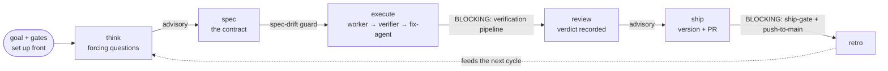
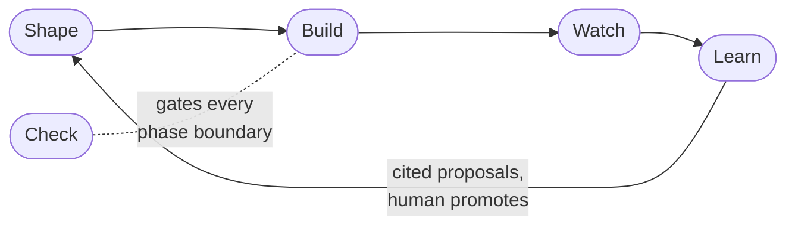

# dwarves-kit

> A closed-loop Claude Code workflow: you set the goal and the gates, agents loop until the verifier passes. Worker → verifier → fix-agent retry, by default.

[](https://github.com/dwarvesf/dwarves-kit/actions/workflows/test.yml)
[](https://github.com/dwarvesf/dwarves-kit/releases)
[](LICENSE)
[](https://code.claude.com)

## Quickstart

```
/plugin marketplace add dwarvesf/dwarves-kit
/plugin install kit@dwarves-marketplace
```

Open your repo and run `/kit:onboard`. It previews every write and adopts the repo with sane
defaults. Then run `/kit:start` at the top of every session: it reads where the repo stands and
hands you the next command. Onboarding never finishes; `/kit:start` is the onboarding.

Condensed walkthrough: [`docs/QUICKSTART.md`](docs/QUICKSTART.md). Full command reference:
[`MANUAL.md`](MANUAL.md).

Agent workflows are shifting from `prompt -> output` to `goal -> loop -> evaluate -> improve -> result`. dwarves-kit is the **closed** kind of that loop: you set the goal and the gates up front, and agents iterate inside them until a read-only verifier passes, never grading their own homework.

It ships as a **toolbox, not an appliance.** Every subsystem is a standalone shell command that already works on its own, `bash lib/board/board.sh --help`, and the same for `gate`/`stats`/`classify`/`spec`/`goal`/`session`/`precedent`/`wrap` (e.g. `bin/precedent find "<query>"`), so there is no `kit` uber-binary and no install step to just poke at it (the same bash reads under pi, opencode, Claude Code, or a bare terminal). Wiring it into Claude Code (`bash install.sh`) adds an always-on safety spine and lets you `--with` exactly the modules you want and nothing else; [Install](#install) has the layers.

The loop itself is one spec-driven lifecycle, **think → spec → execute → review → ship → wrap → retro**, with a gate at every phase boundary:



Two gate classes sit on those boundaries: **blocking** (the verification pipeline, the ship-gate, the push-to-main blocker , mechanical, they stop a bad outcome) and **advisory** (think, review , they surface findings, never block). The autonomous-loop hardening adds a fresh-context re-audit of every done-claim, a kit-default cross-cutting advisor lens on top of the specialized reviewers, and a deployable-done proof gate, so a closed loop can run long without drifting into self-graded slop.

Every build task runs a verification pipeline (worker → verifier → fix-agent retry), and hooks enforce safety automatically (`rm -rf`, push-to-main, force-push, and secret-file reads are blocked). The worker is also **specialized per task**: when a task needs a role no built-in agent covers (security, migration, a doc writer, ...), the kit synthesizes one on the fly and dispatches it, or `/kit:draft-agent` installs a reusable named agent ([SPEC-089](docs/specs/SPEC-089-dynamic-agent-synthesis.md)).

**You drive it by intent, not by memorizing commands.** Say what you want; the kit reads your intent, runs the right step, and stops only at the real decisions:

```
You: "add a --version flag to the CLI"
Kit: scopes it -> writes the spec -> builds + verifies -> ships,
     pausing only where it needs your call.
```

The `/kit:*` commands below are those same actions named explicitly, for when you prefer to type them. You rarely need to.

It is bash-first (every hook readable in 30 seconds), and every component traces to a proven pattern, no novel inventions. The point of the kit is the handoff: a solo technical lead writes the spec, a contractor runs `/kit:execute` against the *same* spec.

New here? **Install** below, then run **your first cycle**. The full operator reference (every command, hook, and agent, plus troubleshooting) lives in [`MANUAL.md`](MANUAL.md).

## Why a closed loop

An open loop (the agent roams free and judges its own output) is a fast slop machine unless your standard is airtight and your budget is unlimited. The kit takes the closed shape instead: a human designs the path once, agents iterate inside it. What makes the loop trustworthy is that the gates that block are mechanical (bash hooks, tests, read-only verifiers), never the agent grading its own homework. The remaining phase gates advise and route rather than block: detect, don't dictate.

| Open loop | dwarves-kit (closed) |
|-----------|----------------------|
| agent plans its own route | the spec is the contract, written before any build (validated on the full lane) |
| agent grades its own work | hard gates are mechanical: bash hooks, tests, read-only verifiers |
| loops until the budget dies | bounded: fix-agent retries max 2, then escalates to a human |
| one loop size fits all | risk lanes: tiny work skips the ceremony entirely |

## The five stages

The lifecycle above is what one run looks like. Across runs, the kit is organized as five stages (formerly called "legs", ADR-0034): **Shape** turns work into contracts, **Build** builds inside them, **Watch** records what happened, **Check** gates every boundary, and **Learn** distills the record into proposals for the next cycle.



This diagram is the stages. For how DATA actually moves through them (telemetry -> proposal -> board -> ship, the ledger write/read paths, and the module map of who calls whom), see [`docs/data-flow.md`](docs/data-flow.md).

Stages are metadata, not directories: each module keeps its name and install unit, and declares a primary stage. The authoritative assignment (machine copy in [`lib/config/module-registry.md`](lib/config/module-registry.md), rendered by `config list`):

| Stage | Modules / subsystems |
|---|---|
| Shape (Specify) | `spec`, `classify`, `precedent`, `goal`, `board` (input side), `sync` (spoke intake; outward mirror is its Watch side) |
| Build (Execute) | `queue`, `mega`, `worktree`, `quiz_gate` |
| Watch (Observe) | `stats`, `session` (capture side), `telemetry`, `sync` (outward mirror side; absorbed the bridge cockpit mirror 2026-07-16) |
| Check (Govern) | `gate`, `money_gate`, `advisor`, `gauntlet`, `wrap` |
| Learn | `learn`, `weekend_batch`, `session` (harvest), `board` (staging/promote), `skill-curator`, `prose_rag` (registry assignment, pending ADR-0034 amendment) |
| (no stage) | `cosmetic` (statusline; orthogonal to the loop) |

Two modules honestly span stages: **board** (Shape's intake on one side, Learn's staging/promote on the other) and **session** (Watch's capture, Learn's harvest).

**What happens to a run's data after it ships:** every gate decision and run outcome appends to the ledgers (append-only, never rewritten). `stats` projects them read-only; `session intel` writes the weekly digest, harness scorecard included; `learn propose` distills cross-run evidence into cited proposals in a staging file; `learn drain` renders that staging for review; `board promote` is the human gate that turns a proposal into a backlog row feeding the next Shape stage. Every automated stage ends at a staging file or a rendered surface, never a direct write to a board or ledger: propose, never dispose.

## Install

Layered by design: the SPINE installs unconditionally (six hooks guarding push, merge, secrets, and commit format, ADR-0024's irreversible boundary); everything else is an opt-in MODULE via `--with <a,b,c>`, recorded in your own project's `kit.toml [modules]` (a per-consumer install record, re-runnable; never a runtime registry a hook reads back). Run the installer with no `--with` at all to get the spine and nothing else.

| Module | What it wires | Kind |
|---|---|---|
| `board` | `backlog-stage` (SessionEnd: stage session work-items to the board); its `--surface` pass also runs `intake-sweep` (consumer-declared deferred-link sources, config-gated) | 1 hook |
| `session` | `context-readiness`, `output-offload`, `pre-compact-backup`, `post-compact-reinject`, `session-state-save`, `harvest`, `citation-guard`; plus a PATH shim for the `session` CLI (`session <intel\|observe\|recall\|report\|semantic>`, ADR-0034: the five prefixed CLIs collapsed into one entry) | 7 hooks + 1 CLI |
| `advisor` | `context-hints` (session-elapsed + keyword skill hints) + `tool-policy-guard` (PreToolUse allow/ask/deny per tool domain; inert until a `tool-policy.json` exists) | 2 hooks |
| `cosmetic` | `auto-format`, `notification`, `slop-cleaner`, `statusline`, `codebase-index`, `permission-auto-approve` | 6 hooks |
| `queue` | `/kit:mega` + `/kit:dispatch` machinery (`lib/queue/orchestrate.sh`), the overnight queue launcher (`lib/queue/queue.sh`) | hookless (lib) |
| `stats` | the `stats` CLI, a read-only projection over the run/gate ledgers | hookless (uv CLI) |
| `quiz_gate` | `/kit:quiz-gate` (ADR-0031 understanding-gate nudge) | hookless (command) |
| `weekend_batch` | the debt-paydown reader/closer (`bin/learn debt`; engine `lib/learn/weekend-batch.sh`, relocated per ADR-0034), invoked by a consumer's own skill or directly | hookless (lib) |
| `bridge` | FOLDED INTO `sync` 2026-07-16. The git↔Hermes cockpit mirror/writeback verbs (`board.sh mirror/status/writeback`, `bridge=on` rows in `boards.txt`) remain runnable as the legacy engine until the SPEC-002 P2 port (kit ID-290) re-lands them as a sync edge | absorbed |
| `worktree` | `worktree-provision` on PATH (manual worktree env-symlink + install provisioner, `lib/worktree-provision/`) | hookless (CLI) |
| `money_gate` | `money-gate` (PreToolUse Edit/Write guard for money-touching edits; inert until you set `MONEY_GATE_REPOS`) | 1 hook |
| `prose_rag` | `prose-rag` recall inject (UserPromptSubmit, dormant until `PROSE_RAG_INJECT=1`) + the `prose-rag` CLI adapter over context-kit's engine binary (`lib/prose-rag/`) | 1 hook + 1 CLI |
| `sync` | `board sync` two-way spoke mirror (BACKLOG.md ⇄ Apple Reminders / Notion / Hermes kanban; engine `lib/sync/`, per-repo `.kit.toml [sync]` config), inert without `[sync] sources` | hookless (lib) |

`team_mode` is a reserved, not-yet-installable slot (parked, see `docs/PHILOSOPHY.md` "Team mode: parked, not absent"); naming it in `--with` errors on purpose.

**Add a module later** (module #13 never re-onboards you): edit `.kit.toml`'s `[modules]` section
by hand, then re-run `/kit:adopt --refresh` (or `bash lib/adopt.sh --refresh <repo>`) to re-wire
`settings.json` to match. Full detail: [`commands/adopt.md`](commands/adopt.md).

```bash
bash install.sh                         # spine only
bash install.sh --with board,stats      # spine + those two
bash install.sh --prune --with board    # explicit trim: re-install down to spine + board
```

### Option 1: Claude Code plugin (recommended)

In any Claude Code session:

```
/plugin marketplace add dwarvesf/dwarves-kit
/plugin install kit@dwarves-marketplace
```

That's it. Hooks, commands, agents, and the skill all install automatically. No bash, no `jq`, no symlinks. Updates via `/plugin update kit`.

To get the kit listed on Anthropic's official marketplace (`claude-plugins-official`), submit it via [claude.ai/settings/plugins/submit](https://claude.ai/settings/plugins/submit). One-time manual step; not blocking the self-hosted install above.

### Option 2: Bash installer (maintainer / power path)

Demoted from the default doc path (Moment 1 of the onboarding design is plugin-only). Reach for it
only in environments without Claude Code's plugin system (CI, project templates, older Claude Code
versions), or as a kit maintainer:

```bash
git clone https://github.com/dwarvesf/dwarves-kit.git ~/.claude/dwarves-kit
cd ~/.claude/dwarves-kit && bash install.sh
```

Requires `jq` (for settings merge) and `git`; the installer refuses to start without them. No root / no package manager (CI images, locked-down containers): drop a static `jq` binary onto PATH instead, e.g. `mkdir -p ~/bin && curl -fsSL -o ~/bin/jq https://github.com/jqlang/jq/releases/latest/download/jq-linux-arm64 && chmod +x ~/bin/jq && export PATH="$HOME/bin:$PATH"` (pick the asset for your arch). Do not hand-copy the kit's files around a missing `jq`: the settings/hooks merge is the step that arms the guardrails, and a partial copy silently ships without them.

**Hooks arm only in a NEW Claude Code session.** The installer registers hooks in `settings.json`, but a session that was already running (and any single-shot headless run: `claude -p`, CI agents) never re-reads them, so every gate is advisory there: gate-ledger calls still work and record, but nothing blocks. Restart the session after installing; treat headless runs as unguarded by design.

Cloning in place is simplest, but `install.sh` also runs from a checkout anywhere. To uninstall: `bash ~/.claude/dwarves-kit/install.sh --uninstall`.

### Pick one (the bash installer is plugin-aware)

The two paths no longer collide. If the plugin is already installed, `install.sh` detects it and does a **compat-only** install: it symlinks the legacy `~/.claude/dwarves-kit/{lib,WORKFLOW.md,AGENTS.md}` paths, so docs that still call `bash ~/.claude/dwarves-kit/lib/<x>.sh` (plain bash, where `${CLAUDE_PLUGIN_ROOT}` is unset) keep resolving, and skips the hook + command registration the plugin already owns. No double-registered hooks. Force the full bash install with `KIT_FORCE_FULL=1 bash install.sh` (e.g. for the `statusLine` HUD, which the v1 plugin schema does not configure).

**Invocation differs by path:** installed as the plugin, commands are namespaced `/kit:<name>` (e.g. `/kit:spec`); via the bash installer they resolve bare `/<name>` (e.g. `/spec`). This README uses the plugin form.

## Your first cycle

After install, open a Claude Code session in your project and run one full lap. A tiny change is the best first try. Told as a story: an interview turns your ask into a blueprint, a crew builds it, and an inspector won't let it leave without a stamp; the full workshop tour is one page, `/kit:onboard` or [`docs/glossary.md`](docs/glossary.md).

1. `/kit:start` orients you and suggests the next step.
2. `/kit:think` and describe the change (e.g. "add a `--version` flag to the CLI"). It throws 6 forcing questions at the idea; answer them.
3. `/kit:spec` writes the contract to `docs/specs/SPEC-NNN-<slug>.md`.
4. `/kit:execute` runs the autonomous build: a worker implements the spec (specialized on-demand per task , a security/migration/etc. role synthesized and injected when the task warrants it, SPEC-089), a verifier checks it against the acceptance criteria, a fix-agent retries fixable failures (max 2).
5. `/kit:review` then `/kit:ship`: review gate, then version bump, changelog, conventional commit, PR.

That is the whole loop. The spec is the unit of handoff: a contractor running `/kit:execute` reads the same `docs/specs/SPEC-NNN-<slug>.md` you wrote. To see the artifact set without running anything, browse [`examples/hello-spec/`](examples/hello-spec/).

## Workflow

```
/kit:start          Detect state, suggest next command (entry point)
/kit:onboard        Guided first-run: install mode, adopt, module picker, five-stage tour
/kit:think          Challenge the idea (5 min)
/kit:design         Opt-in: shape the solution with you before /spec
/kit:spec           Generate the spec + 4 parallel researchers (15-30 min)
/kit:spec-validate  Stress-test the spec (10 min)
                     [hand off to contractor]
/kit:execute        Autonomous: worker > verifier > fix-agent retry loop
  or
/kit:next           Manual: pick next task, load context, you drive
                     [hooks enforce during build]
                     [statusline shows context budget]
                     [session-state-save persists progress on every stop]
                     [slop-cleaner flags bloat at stop points]
/kit:review         Single-pass review (10 min)
/kit:review-team    Parallel 3-lens review, confidence-gated + validated findings
/kit:verify         Re-run tests read-only; PASS / FAIL / INCONCLUSIVE
/kit:docs           Update all docs to match code (5 min)
/kit:explain        Literate-diff explainer: understand a change, not click-to-merge it (ADR-0031)
/kit:quiz-gate      ★-tap nudge: a 5-question quiz from the diff before merging a significant PR (ADR-0031)
/kit:pitch          Outward buy-in doc from the spec + proof + impl-notes + grill record; ends in an ask, never fabricates (SPEC-140)
/kit:ship           Review gate, version bump, changelog, commit, PR
/kit:retro          Retrospective (10 min, after shipping)
```

Work is sized by risk lane before it starts (tiny / normal / full / bug, plus a `backfill` lane for reviewing an existing codebase and writing the operating-layer docs without changing behavior). The lanes, the gate at each phase boundary, and the operate-contract the agent follows live in [`AGENTS.md`](AGENTS.md) and [`WORKFLOW.md`](WORKFLOW.md).

## Verification pipeline (/execute)

Every task goes through: worker > task-verifier > fix-agent (if needed). The worker never grades its own work; the verifier is a separate read-only agent.

```
            /kit:execute (orchestrator)
            owns the spec's task list,
            dispatches one task at a time
                       |
                       v
              +----------------+
              | worker         |  implements the task
              +----------------+
                       |
                       v
              +----------------------+
              | task-verifier        |  read-only gate: acceptance
              | (cannot edit code)   |  criteria + tests
              +----------------------+
                 |        |          |
               PASS  FAIL:fixable  FAIL:escalate
                 |        |          |
                 v        v          v
            mark done  +-----------+  stop,
            next task  | fix-agent |  ask the human
                       +-----------+
                            |
                            +--> back to task-verifier
                                 (max 2 retries, then escalate)
```

Within one spec, tasks run sequentially. Across specs, `/kit:dispatch` fans out disjoint `VALIDATED` specs into parallel git worktrees behind a disjointness gate; across sessions, a passive goal registry (`lib/goal/goal-registry.sh`) keeps concurrent same-machine sessions from colliding. The kit deliberately stops short of a DAG scheduler, a coordinating daemon, or cross-machine orchestration. For those, run GSD v2 or Nimbalyst alongside it.

## What it does

<details>
<summary><b>Hooks</b> (automatic, event-triggered)</summary>

| Hook | Event | What it does |
|------|-------|-------------|
| safety-gate | PreToolUse(Bash) | Blocks rm -rf (build-artifact allowlist), push to main, force push, DROP TABLE, git reset --hard, kubectl delete |
| secrets-guard | PreToolUse(Read\|Edit\|Bash) | Blocks reads of secret files (.env, ~/.ssh, ~/.aws, .pem); canonicalizes the path first |
| commit-format | PreToolUse(Bash) | Blocks non-conventional / >72-char / spec-ID commit subjects |
| ship-gate | PreToolUse(Bash) | Blocks push/PR without a proof-of-done record + recorded lane gates (ADR-0024 boundary) |
| context-readiness | SessionStart | Detects project + board state (`board:Nq`), suggests the next step intent-first |
| context-hints | UserPromptSubmit | Injects session elapsed/idle time + keyword-matched skill hints (empty map by default; wire your own via CONTEXT_HINTS_SKILLMAP) |
| anti-rationalization | Stop | Catches Claude declaring work done prematurely |
| slop-cleaner | Stop | Flags bloated code in recently modified files |
| session-state-save | Stop, SubagentStop | Persists session state, rotates last 10 archives |
| citation-guard | Stop | Flags (or blocks, CITATION_GUARD_STRICT=1) hallucinated file:line citations in the final message |
| money-gate | PreToolUse(Edit\|Write\|MultiEdit) | Asks before a money-touching edit lands in a repo named in MONEY_GATE_REPOS (inert unset) |
| prose-rag | UserPromptSubmit | Injects relevant prior notes on recall-shaped prompts (dormant unless PROSE_RAG_INJECT=1) |
| auto-format | PostToolUse(Write\|Edit) | Runs formatter on every file change |
| output-offload | PostToolUse(*) | Offloads a >2k-token tool output to a file + leaves a terse pointer |
| spec-drift-guard | PreToolUse(Write) | Warns when creating files not in the spec |
| pre-compact-backup | PreCompact | Saves structured session snapshot before compaction |
| harvest | PreCompact, SessionEnd | Stages durable session learnings to a repo-relative ledger (PreCompact); drafts a LAB_LOG entry (SessionEnd --lab-log). Never writes a durable home; a human flushes |
| backlog-stage | SessionEnd | Stages forward-looking work-items from the session to a repo-relative staging file. Never writes the board directly |
| intake-sweep | SessionStart (via backlog-stage --surface) | Sweeps consumer-declared deferred-link sources (`_meta/intake-sources.json`: jsonl / command adapters) into the same staging file. Config-gated no-op; never writes the board directly |
| post-compact-reinject | PostToolUse(compact) | Re-injects critical rules after compaction |
| notification | Notification | Desktop alert when Claude needs input |
| permission-auto-approve | PermissionRequest | Auto-approves read-only operations (pipe-safe) |
| tool-policy-guard | PreToolUse | Enforces the tool-choice policy file (allow/ask/deny per tool domain; the enforcement half of the dashboard's tool-policy page) |
| statusline | StatusLine | Shows model, branch, context %, cost, thinking mode |
| codebase-index | SessionStart (opt-in) | Background-indexes the repo into codebase-memory-mcp |

Which hooks BLOCK vs warn vs neither is a declared contract: `docs/architecture.md` "Hook fallback layer" (hard / advisory / convenience, parity-pinned).

</details>

<details>
<summary><b>Commands</b> (manual, human-triggered)</summary>

| Command | Phase | What it does |
|---------|-------|-------------|
| /kit:start | Entry | Detect project state, suggest next command |
| /kit:grill | Intake | Universal intake interview: type-shaped questions, one at a time, answers written as they resolve |
| /kit:wayfind | Intake | User-invoked: chart a too-foggy-for-one-session effort as a decision map (`_meta/megagoals/<slug>/map.md` + typed tickets), resolve one per session, hand off to /kit:spec or a ROADMAP |
| /kit:think | Think | 6 forcing questions to stress-test an idea |
| /kit:design | Design | Opt-in: interactive solution-design beat (one question at a time) before /spec |
| /kit:devs-team | Design | Opt-in: 5-lens parallel critique of the solution (brief or spec), report-only |
| /kit:visual-team | Design | Opt-in: 5-lens parallel critique of a visual/UI design (downstream-facing) |
| /kit:ui-design | Design | Opt-in, downstream: UI brief -> generate (frontend-design) -> critique -> revise loop |
| /kit:prototype | Design | Opt-in: throwaway spike answering ONE design question (logic TUI or 3-5 UI variants); decision folds into the brief/spec, code survives on a `prototype/<name>` branch |
| /kit:assign | Orchestrate | Turn a backlog item (ID-NNN) into a scoped goal draft + route it into the lane |
| /kit:dispatch | Orchestrate | Fire N disjoint VALIDATED specs concurrently, each in its own worktree, behind a disjointness gate; lead-owned merge |
| /kit:mega | Orchestrate | Mirrors the plan-for-mega-goal skill: decompose 3-8 dependent sub-goals, front-load every clarification once, set the per-run merge config, hand off to the bounded loop; ship-layer auto-merge rides the ship-gate via `lib/goal/mega-merge.sh`, never bypasses it |
| /kit:spec | Spec | Generate docs/specs/SPEC-NNN-<slug>.md with 4 parallel research agents |
| /kit:spec-validate | Spec | 5 adversarial reviewers attack the spec (incl. solution-design + extensibility) |
| /kit:test-plan | Spec | Opt-in: coverage matrix from acceptance criteria into the spec's `## Test plan` section |
| /kit:feature-map | Spec | Source-cited, agent-checkable feature inventory for ANY target project: per-module spec + a top-level checklist. Standalone (what does this codebase do) or migration source of truth (what needs porting) when a port target is named |
| /kit:execute | Build | Autonomous: worker > verifier > fix-agent retry loop |
| /kit:next | Build | Lightweight: picks next undone task, loads context, you drive |
| /kit:verify | Verify | Read-only re-run of task-verifier + integration-verifier, no rebuild; verdict PASS / FAIL / INCONCLUSIVE with the claim restated falsifiably |
| /kit:battery | Verify | The full independent right arm for a finished branch: fresh-context acceptance verifier + multi-lens review + advisor in parallel at prescribed model tiers, baseline-aware, findings merged, fixes applied by the lead |
| /kit:greenlight | Ship | Post-push CI-green lane: snapshots an open PR's checks, fixes real failures via the fix-agent shape, retries flaky ones within a bounded budget, reports one terminal state; opt-in, never hard-gates merge |
| /kit:debug | Bug (off-cycle) | Systematic debug loop: root cause before any fix, evidence ledger, 3-fix wall |
| /kit:review | Review | Paranoid single-pass code review |
| /kit:review-team | Review | Parallel 3-lens review (security + architecture + test-coverage); findings confidence-gated, deduped by fingerprint, verdict-driving ones adversarially validated per finding |
| /kit:test-plan-review-team | Verify | 5-lens adversarial critique of the spec's `## Test plan`, bounded revise loop, report-only |
| /kit:test-write | Build | Turns a SOLID-verdict `## Test plan critique` into real, executing test code via test-writer, one case per matrix row |
| /kit:onboard | Entry | Guided first-run: detect install mode (plugin/bash/both/none), offer /kit:adopt, pick modules, capture consumer knobs, disclose plugin-path gaps, five-stage tour; previews + confirms every write, decline = no-op |
| /kit:adopt | Entry | Retrofit the operate-contract onto an existing repo (AGENTS.md, loader, proof marker, classifiers), idempotently |
| /kit:docs | Docs | Cross-reference diff against all doc files, fix drift |
| /kit:explain | Understand | Literate-diff explainer (background -> intuition -> prose-ordered diff -> diagram); composes narrate-log + svg-knowledge-diagram, grounded in the diff not the agent's narrative (ADR-0031) |
| /kit:quiz-gate | Understand | ★-tap nudge before merging a significant+worthy gate PR: 5 diff-grounded quiz questions routed through deep-understand, three logged responses (engage/defer/wave), advisory never must-pass (ADR-0031) |
| /kit:pitch | Understand (outward) | Assembles an outward buy-in doc from the spec, proof-of-done, implementation-notes, and grill/DEBT ledger records; the outward twin of /kit:explain, ends in an ask not a quiz; never fabricates a missing source (SPEC-140) |
| /kit:ship | Ship | Review gate, version bump, changelog, commit, PR |
| /kit:wrap | Land | Session-scoped landing step after ship: board rows, the operator's own PR merges, deploy check, branch and worktree tidy, the activity line, calls /kit:retro when a shipped PR merged |
| /kit:retro | Reflect | What worked, what hurt, action items for next cycle |
| /kit:kit-health | Meta | Self-assessment against kit philosophy |
| /kit:absorb | Meta | Maintainer-only: audit upstream sources (Credits drift + seed-rescan) + draft a dated absorption proposal |
| /kit:draft-agent | Meta | Meta-agent agent-builder: generates a subagent (or sub-goal file) from a description and installs it by default (`--draft` to stop at a review draft) |
| /kit:gauntlet | Meta | Probe-convergence engine: converges an artifact (docs, a runbook, a spec, an API surface) toward a fixed outcome by having a fresh clean-room probe agent attempt the outcome contract unaided each round; failures revise the artifact, every round persists a full run record. Onboarding ships as the reference preset |

</details>

<details>
<summary><b>Agents</b> (dispatched by commands) and <b>Skills</b> (Claude-triggered)</summary>

| Agent | Dispatched by | What it does |
|-------|--------------|-------------|
| task-verifier | /execute, /verify | Read-only verification against spec + tests |
| integration-verifier | /execute, /verify | Read-only cross-task wiring + global acceptance check (multi-task specs) |
| acceptance-verifier | /verify | Executes the spec's `## Verification` section against the build (read-only) |
| system-verifier | /verify | Runs the whole project's test suite end to end (read-only) |
| recheck-verifier | /execute | Fresh-context re-audit of a verifier PASS: re-executes the recorded command |
| claim-verifier | any command | Adversarial N-skeptic panel over a load-bearing free-text claim |
| fix-agent | /execute | Targeted fixes on FAIL:fixable (max 2 retries) |
| data-etl-worker | /execute | Domain implementer: pipelines/transforms (DuckDB SQL first) |
| db-migration-worker | /execute | Domain implementer: schema migrations + rollback + backfill |
| code-reviewer | /review-team | Focused review with configurable lens |
| security-reviewer | /review-team | Deep OWASP-style security audit |
| api-reviewer | /review-team | API-contract lens (breaking changes, versioning, idempotency) |
| frontend-reviewer | /review-team | Frontend lens (a11y, semantic HTML, focus, responsive) |
| infra-reviewer | /review-team | Infra lens (deploy/rollback safety, CI/CD, least-privilege) |
| performance-reviewer | /review-team | Performance lens (hot paths, N+1, allocations, caching) |
| advisor | final boundary | Cross-cutting kit-default lens: critique + over-suggest modes |
| break-it | /kit:battery (escalation) | Adversarial prober: hunts one concrete input the suite does not constrain; rung 2 of coverage -> probe -> mutation |
| brief-reviewer | /think | Static review of a brief/requirement before it hardens into a spec |
| responding-to-review | /review-team | Verifies review findings, pushes back when wrong, proposes fixes (no performative agreement) |
| slop-stripper | /review-team | Behavior-preserving AI-slop strip pass: surgical edits only, never behavior changes unless fixing a real bug |
| agent-effectiveness | agent authoring | Validates a new/changed agent definition's effectiveness (4 lenses) |
| doc-verifier | /docs | Read-only check that docs match the live codebase |
| devops-triage | on-demand | Read-only production-alert triage: Workers Logs history + git around the deploy sha into a bounded root-cause verdict |
| research-stack | /spec | Maps technology stack (brownfield) |
| research-context | /spec, /kit:test-plan | Quick brownfield orientation (endpoints, models, UI, tests, recent history), capped at 80 lines |
| research-architecture | /spec | Maps architecture patterns and conventions |
| research-pitfalls | /spec | Finds landmines before implementation |
| research-features | /kit:feature-map | Deep, uncapped, source-cited feature inventory for any project: MIGRATE table + parity contract when porting, else a behavior contract |
| meta-agent | /draft-agent | Drafts a new subagent (or sub-goal file) from a one-line description |
| test-writer | /kit:test-write | Turns a reviewed test-plan coverage matrix into runnable test code, one case per matrix row |
| audit-scanner | every audit-loop skill | Shared read-only Tier-2 evidence scanner for audit-loop instances; roster physically cannot write, and it judges saved evidence rather than gathering it (a network-side Tier 1 saves output first) |

| Skill | What it does |
|-------|-------------|
| backlog-reconcile | Audits a repo's `_meta/BACKLOG.md` Active queue (audit-loop instance, general-purpose): row `Status` verdicted against its `Target artifact` spec's own `Status:` header or a git-log match, fixes behind a PR gate |
| doc-drift | Whole-estate doc audit (audit-loop instance): enumerates every living doc, verdicts each claim against the live repo, fixes drift behind a PR gate |
| ci-drift | Whole-estate CI audit (audit-loop instance): enumerates every workflow + GitHub-side state (enabled, secrets/vars, runners, releases, environment policy), verdicts each against the live repo, fixes drift behind a PR gate |
| gauntlet-proof-audit | Audits committed gauntlet run records (audit-loop instance, general-purpose): markers well-formed, recorded verdict vs committed `checker-output.txt`, findings-count reconciliation, scrub clean, run-dir grammar; REMOVE disallowed, report-first |
| topology-drift | **Maintainer-only** (dwarves-kit repo dev only): audits THIS KIT's own feature estate (audit-loop instance), cross-checks the generated `docs/FEATURES.md` registry against the `docs/workflow-paths.md` path index both directions, re-places only delta features on the topology, PR-gated. To inventory a project the kit is pointed at, use `/kit:feature-map` instead |
| web-drift | Live-website agent-readiness audit (audit-loop instance, general-purpose): probes every site in `WEB_DRIFT_SITES` with `lib/webcheck` over read-only HTTP (groundwork, page, API tiers), verdicts each `(site, check)` pair, and files fixes as board rows in the repo that owns the site's source. Inert until the consumer declares its sites |
| get-api-docs | Fetches curated API docs via Context Hub before coding |
| loop-engineering | Designs a new bounded loop for the kit's orchestration: the gate (should this be a loop), then the anatomy (artifact / scanner / reviser / stop condition) on the generic bounded-revise engine |
| memory-tidy | Audits a repo's `.claude/memory` store: evidence-gated verdicts, PR-gated merges/deletions, index rebuild (judgment half of `stats memory-sweep`) |
| observe | Queries/renders the control plane (runs, gate verdicts, conformance, spend/cache economics, replay, dashboard) via the lib/bench CLIs |
| skill-review | Reviews + promotes skill drafts staged by skill-curator |
| stats | Queries/renders the ledger read plane (relocated from `lib/stats/skill/` per ADR-0034 so it actually installs) |

</details>

## Who this is for

A solo technical lead handing off implementation to contractors. The kit covers the full lifecycle with one shared spec format: the contractor running `/kit:execute` reads the same `docs/specs/SPEC-NNN-<slug>.md` you wrote with `/kit:spec`.

Also for a builder using Claude Code 6-8 hours a day who wants a context-budget HUD, automatic safety guards, session-state persistence across compaction, and slop detection at stop points.

## Who this is NOT for

- **Teams of 10+ with a dedicated DevOps pipeline.** The kit targets one engineer (or one lead + delegated contractors); one lead can still fan out parallel workers (`/kit:dispatch`) and run concurrent same-machine sessions safely. Cross-machine orchestration, 3+ live operators, or goal-ordering chains are out of scope, pair the kit with Nimbalyst or Conductor for that.
- **Anyone who wants a UI.** The kit is bash hooks + markdown commands. Open any file in a text editor; it's all readable.
- **Projects already happy with GSD, gstack, or Trail of Bits' configs as standalone tools.** The kit's value is integration; if format-translation overhead between standalone tools isn't hurting you, don't switch.

## Project structure

<details>
<summary>Directory layout</summary>

```
dwarves-kit/
  tool.toml                     Kit metadata (name, version, language=bash, deps)
  AGENTS.md                     Tool-agnostic operate-contract front door (any runtime reads it first)
  WORKFLOW.md                   The cycle, the risk-tier lanes, the gates, and the flow/loop reference (ASCII diagrams)
  MANUAL.md                     Operator reference: commands, hooks, agents, natural-language scenarios, troubleshooting
  README.md / CONTRIBUTING.md / CHANGELOG.md / VERSION / LICENSE
  CLAUDE.md                     Project template; the Claude-Code layer on top of AGENTS.md
  install.sh / settings.json    Bash install path
  .claude-plugin/               Plugin install path (plugin.json, marketplace.json)
  .github/workflows/test.yml    CI: macOS + Ubuntu test matrix
  bin/                          STABLE consumer entrypoints (SPEC-184, one `<subsystem> <verb>` grammar per ADR-0034): `board`/`classify`/`gate`/`goal`/`learn`/`mega`/`precedent`/`queue`/`session`/`spec`/`stats`/`config`/`plugin-check` thin forwarders to `lib/<subsystem>/`, plus the module CLIs (`prose-rag`, `worktree-provision`, `skill-improve`, `skill-review`) that keep their own names, and two standalone maintainer tools outside the forwarder pattern (`activate`, `release`, licensing and release cutting). A consumer (an adopted repo's board shim, the adopt-injected CLAUDE.md block) references `$DWARVES_KIT/bin/<name>`, NEVER a deep lib path, so an internal lib reorg cannot silently break it (the board-shim class of bug). Deployed by install.sh next to lib/.
  agents/                       Subagents dispatched by commands
  commands/                     Markdown command prompts
  hooks/                        Hook scripts + hooks.json plugin manifest
  lib/gate/dispatch-gate.sh          Disjointness gate + drift guard for /kit:dispatch (pure-bash concurrency moat)
  lib/classify/lane-classify.sh          Deterministic task-type -> risk-lane classifier + advisory floor check (used by /kit:assign + /kit:dispatch); optional `--files "<paths>"` on classify/explain/check escalates the kit-machinery gate on an actual EDIT to lib/ or hooks/, not a mere textual mention (SPEC-105, edit-vs-mention)
  lib/goal/goal-registry.sh          Cross-session running-goal registry: claim/list/log/release (multi-session moat + monitor)
  lib/goal/goal-drafts.sh            Goal-draft lifecycle: archive shipped drafts to .claude/goals/done/
  lib/telemetry/lane-telemetry.sh         Read-side lane-effectiveness aggregator over the run ledgers: report + misfires (reviewed at /kit:retro)
  lib/queue/orchestrate.sh            Non-LLM mega-goal driver: one fresh `claude -p` session per sub-goal so no session marathons (SPEC-087); session-per-sub-goal, NOT the GSD-v2 engine (no priority/cross-machine/state-store). `run <dir>` flags: `--dry-run` (plan only), `--step` (pause for the operator between sub-goals), `--stream` (live stream-json tee'd to `.orchestrate/<id>.stream.jsonl`), `--board=roadmap|kanban|both` (event-sourced per-mega-goal kanban derived to `<dir>/BOARD.md` via `lib/board/backlog.sh`; default detects, ROADMAP stays canonical). `flip <dir> <id>` box-flip subcommand (mkdir-lock guarded, atomic). DAG-wavefront ON by default (SPEC-106, ADR-0030, ID-090): at the default `WAVE_CAP=2` it runs dep-independent, `## Touches`-disjoint sub-goals concurrently (one worktree per session); a mega-goal whose sub-goals declare no `## Touches` still serializes (no-op), and `WAVE_CAP=1` forces the always-serial loop. `commands/mega.md` emits a `## Touches` per generated sub-goal so new mega-goals are wave-eligible. A `gate` sub-goal holds only its dependent chain; `gate!` halts the whole loop for a human. Robustness env (advisory): `WATCHDOG_STALL_SECS>0` backgrounds each session + flags it `stalled` after that long with no output (never kills); a dead/incomplete session never advances its box. Emits a `gate-ledger start` per dispatched sub-goal (rid from the goal file's `**Branch:**`) so mega-dispatched runs are tracked in `lane-telemetry`, not `?` (SPEC-101). Multiplexer panes (SPEC-119, opt-in `MULTIPLEXER=1`): each wave session runs in its own tmux window (`TMUX_CMD`/`TMUX_SESSION` seams) for capture-pane/send-keys watch + intervene. Viewer push (SPEC-120, `PANE_VIEWER=auto` DEFAULT): on wave spawn one viewer tab auto-opens attached to the wave's tmux session (cmux/kitty/wezterm/ghostty/iterm/terminal auto-detected); `none` = pull only; headless degrades silently; unknown values rejected at pre-flight. Subagent panes (SPEC-234): `panes <megadir> <target>...` grows one READ-ONLY tmux window per resolved transcript (a jsonl path, a directory of them, or `--latest` to derive the conductor's own `~/.claude/projects/<slug>/*/subagents` dir) for the DEFAULT background-subagent run mode, which has no wave to attach a pane to otherwise; each window runs `tail -F | jq` via the hidden `_pane-tail` re-entry (no shell in the pane -- steering stays with the conductor). `PANE_TAIL_JQ` overrides the formatter (default `lib/queue/pane-tail.jq`, a control-byte-stripping, length-capped line formatter for the subagent transcript schema). Always rc 0; skips warn on stderr and land in a `[panes] spawned N, skipped M` summary. Gitignore `.orchestrate/` + `BOARD.md` + `HANDOFF*.md` (derived/runtime)
  lib/queue/queue.sh                  Overnight queue LAUNCHER (SPEC-148): drives REAL interactive Claude Code `/goal` sessions via `tmux` send-keys (NOT headless `claude -p`, to sidestep the AUTH/KILL-CLASS risk; cmux was tried and dropped, no CLI-verified argv-safe launch primitive per SPEC-119/121). `run <src.tsv>` (rows `slug<TAB>repo<TAB>pointer`) opens a fresh window per queued mega, types `/goal <pointer>` + Enter, polls `capture-pane` for the completion marker (`RUNNER_DONE`/`RUNNER_GATED`, line-anchored AND blank-line-guarded so a soft-wrapped echo of the typed prompt cannot false-trigger), journals each verdict to `queue-journal.tsv`, and stops the night after two consecutive `error`-or-`stalled` megas. `--from-boards` rows get a `realpath`-resolved allow-list confinement (`QUEUE_ALLOWED_POINTER_GLOB`, defense-in-depth on top of sub-goal 04's own; a hand-authored tsv is exempt). Flags: `--dry-run`, `--max-megas N`, `--from-boards`. CONSUMER config: `TERMINAL_MUX`(tmux only)/`MUX_CMD`/`QUEUE_CLAUDE_*`/`QUEUE_JOURNAL`/`QUEUE_*_SECS`/`QUEUE_ALLOWED_POINTER_GLOB`. Aliased as `orchestrate.sh queue <src>`. Idempotent (a `done` slug is skipped on re-run)
  lib/goal/mega-merge.sh             Ship-layer auto-merge ENFORCEMENT for /kit:mega (ADR-0028 P2/P3): `gate <rid> <lane>` (decision, reuses `lib/gate/gate-ledger.sh check`) + `merge <pr> <rid> <lane> [--execute] [--posture=<val>]` (action; refuses unconditionally on a failing/missing gate, dry-run by default, `MEGA_MERGE_POSTURE` team-review opt-out) + `mark <pr> [repo]` (the SPEC-100 mark half, ID-089: opens a gate/gated-final PR as draft + `do-not-merge` so the `_merge_exclusion` guard always has a mark to catch; idempotent, gh via `MEGA_MERGE_GH`)
  lib/board/board.sh                  The cockpit board command (SPEC-146; `mirror`/`status` added by SPEC-147; `writeback` added by SPEC-149): `board|next|set|states|priority [mode]` on one repo's BACKLOG.md (`--backlog-file`), `all <cmd>` for a cross-repo registry render (`--repo-root`/`REPO_ROOT`, `boards.txt`), `queue [--dry-run]` -- walks the registry, parses every repo's board via `lib/board/parse-board.sh`, and emits an allow-listed `slug<TAB>repo-path<TAB>pointer-path` feed for an overnight runner -- `mirror`/`status` (SPEC-147): a one-way git -> Hermes kanban bridge over opt-in (`bridge=on` in `boards.txt`) repos + active mega-goals, `hermes kanban` CLI only (ADR-0001 native-first, no SQLite ATTACH), idempotent (a second run on an unchanged board is a zero-op no-op), incremental snapshot persistence -- and `writeback [--dry-run]` (SPEC-149): the reverse leg, a Hermes-side card status move flows back into a repo's BACKLOG.md as a reviewable, HELD `chore/board-sync` PR (never auto-merged), gated by the mirror snapshot's `row_hash` conflict rule (git wins, always; a missing/corrupt snapshot refuses ALL edits rather than silently applying everything). Substantial mirror logic lives in `lib/board/board-mirror.sh`; substantial writeback logic lives in `lib/board/board-writeback.sh`; `board.sh` stays the thin dispatcher. Base kanban render still delegates to `lib/board/backlog.sh`; the `priority` quadrant awk + cross-repo `priority matrix` pivot are migrated in verbatim (byte-identical output is a pinned non-regression, see `docs/verification/board-tool/`). No personal data in the kit: the registry + repo paths + Hermes target are consumer config read at runtime.
  lib/board/parse-board.sh            The one structured BACKLOG.md parser other tools reuse (SPEC-146): `rows <file>` (id/status/full-line) and `queue-rows <file> <repo-name> <repo-root>` (allow-listed `#queue{repo=...,pointer=...}` token extraction -- charset gate, repo self-consistency, `../` traversal hardening, existence check; every failure is a skip with a stderr reason, never a hard error)
  lib/board/board-mirror.sh           The git<->Hermes kanban bridge engine (SPEC-147), backing `board.sh mirror`/`status`: extracts opted-in BACKLOG.md rows (reusing `lib/board/parse-board.sh`) + active mega-goal roadmaps into normalized rows, diffs them (bash + `jq`/awk keyed comparison, no DuckDB) against an incremental NDJSON snapshot, and loads via `hermes kanban` CLI verbs only. Reachable native states are `{triage, ready, blocked, done}` only -- `todo`/`running` were probed live and found to have no durable CLI-only path (auto-promote back to `ready` within seconds); `_target_native`/`_create_flags_for`/`_followup_for` document the full state-mapping + Hermes-CLI-reality findings. `apply-plan` decodes each op's argv over NUL-delimited jq output (never a templated shell string), so a multi-line card body is preserved as one opaque argv element end to end -- the fix for a real bug this build's own live dev-home E2E caught (a newline-delimited decode silently split a multi-line body into extra positional args, rejected by the real CLI, masked by a naive stub). `HERMES_BIN` overrides the binary for tests (a stub logs argv; no real Hermes calls in the automated suite).
  lib/board/board-writeback.sh        The git<->Hermes kanban bridge WRITEBACK leg (SPEC-149), backing `board.sh writeback`: sources `lib/board/board-mirror.sh` (not re-forked) for extract/hash/native-state machinery. `diff` reads each opted-in repo's live board (`hermes kanban --board <b> list --json`, one batched call per board) + the SPEC-147 mirror snapshot, and builds a validated changeset of rows whose Hermes status moved -- validating opted-in repo (defense in depth on top of the mirror's own filter), a legal `backlog.sh` reverse-mapped target status, and the row_hash CONFLICT RULE (a Hermes-side edit applies only if the row's current git-side hash still equals the snapshot's recorded value; git wins, always). A missing or corrupt snapshot REFUSES ALL edits (explicit error, nonzero exit) rather than degrading to "no conflicts, apply everything". `apply` builds the `chore/board-sync` branch in an ISOLATED `git worktree` off the CURRENT HEAD (never the caller's own checkout, never a stale ref -- this is what keeps a concurrent append-only writer's row safe), edits ONLY the Status column of matched rows (reusing `lib/board/backlog.sh`'s own `set`), commits with `actor=hermes` in the body, pushes, and opens a HELD PR via `gh pr create` (argv-only, never a templated shell string; never auto-merged). Snapshot refresh updates ONLY `hermes_status` (to stop re-diffing the same not-yet-merged move); `row_hash` passes through UNCHANGED (the git SoT hasn't actually changed until the PR merges) -- `mirror`'s own idempotence self-heals the row once it does. `GH_BIN` (mirrors `HERMES_BIN`) overrides the `gh` binary for tests; no real Hermes write call or `gh` API call happens in the automated suite.
  skills/                       Claude-triggered skills (one folder per skill; roster in the Skill table above)
  rules/                        Path-scoped coding-standard templates
  examples/hello-spec/          Demo: small CLAUDE.md + SPEC.md walkthrough
  tests/test-hooks.sh           Hook behavior assertions
  tests/test-meta.sh            Structural integrity (manifests, frontmatter, cross-links)
  docs/specs/SPEC-NNN-<slug>.md  Specs, tracked in place via Status header (DRAFT/VALIDATED/SHIPPED); hooks pick the active one by git branch
  docs/                         The kit's design record (not needed to USE the kit; see docs/README.md)
    README.md                   Map of docs/: what each file is, and that you can skip it to use the kit
    PHILOSOPHY.md               Design principles, target user, rejection list
    architecture.md             Components, data flow, the SDLC state machine, Collaborative Design Protocol, deps
    execution-planes.md         The four ways the kit runs agents, how they hand off, their trust models
    decisions/                  One ADR per file (NNNN-<slug>.md); supersession recorded in the Status line
    specs/                      Specs (SPEC-NNN-<slug>.md); also the live spec store the hooks detect
    retro/                      Per-cycle retrospectives (output of /kit:retro)
    research/                   Dated deep-scans that fed specific specs
  _meta/BACKLOG.md              Phased task backlog
```

For the full file listing including individual agent/hook/command names, run `git ls-files` or browse the repo on GitHub.

</details>

## Reference

**Debug mode.** Set `DWARVES_KIT_DEBUG=1` and every hook logs its decisions to stderr. Useful when a hook misbehaves or you want to understand why something was blocked or approved.

**Hook logs.** Hooks that make enforcement decisions append to `~/.claude/dwarves-kit/logs/` (`anti-rationalization.log`, `safety-gate.log`, `spec-drift-guard.log`, `slop-cleaner.log`). These build the eval corpus for future optimization.

**Weekly scheduler.** The kit ships ONE weekly LaunchAgent (ADR-0034): a dispatcher over a declarative jobs list (session-intel digest, `learn propose` staging; adding a job = one line, never a new plist). Consumer instantiates it: `bash deploy/macos/install`; runbook at [`deploy/macos/README.md`](deploy/macos/README.md).

**Testing.** `bash tests/run-workflow.sh` runs every step of the CI workflow locally in order and prints only the red ones (side-effect files restored); `bash tests/test-hooks.sh` covers hook behavior (safety-gate blocking, anti-rationalization patterns, permission-auto-approve pipe-injection protection); `bash tests/test-meta.sh` covers structural integrity (manifests, frontmatter, cross-links).

**External dependencies** (install alongside, not bundled):

- [Context Hub](https://github.com/andrewyng/context-hub) - `npm install -g @aisuite/chub`
- [Context7](https://github.com/upstash/context7) - MCP server for library docs
- [codebase-memory-mcp](https://github.com/DeusData/codebase-memory-mcp) - AST-level codebase indexing

**Codebase index (opt-in).** If `codebase-memory-mcp` is installed, the
`codebase-index.sh` SessionStart hook keeps the current repo's structural index fresh
in the background (built on the first session in a repo, incremental refresh after),
so `/kit:spec` and `/kit:execute` query the index (`search_code`, `search_graph`,
`get_architecture`, `trace_path`) instead of grepping, cutting orientation cost. With
the tool absent the hook no-ops and the kit greps exactly as before, nothing to
configure and nothing breaks. Enable: put the binary on `PATH`, run
`claude mcp add --scope user codebase-memory -- codebase-memory-mcp`, then re-run
`install.sh`.

## v2 roadmap (not yet built)

- Prompt-type anti-rationalization hook (Haiku evaluation instead of grep patterns)
- /qa command with headless browser testing (requires Playwright)
- Intra-spec parallel task dispatch in /execute (cross-goal fan-out across specs already ships as /kit:dispatch; this is the deferred intra-spec case)
- Multi-harness packaging (Codex / Cursor / Gemini / OpenCode), deferred until real demand

## Changelog

See [docs/CHANGELOG.md](docs/CHANGELOG.md) (root `CHANGELOG.md` is a thin pointer stub, SPEC-185). It's the source of truth; the README does not duplicate it.

## Credits

Patterns extracted from:

- [GSD v1 / get-shit-done](https://github.com/gsd-build/get-shit-done) - spec generation, the original planning-dir convention (since unified onto docs/specs/), 4 parallel researchers. Distinct from GSD v2 ([gsd-build/gsd-2](https://github.com/gsd-build/gsd-2), npm `gsd-pi`), a separate standalone agent on the Pi SDK referenced as an external execution runtime, not a pattern source
- [gstack](https://github.com/garrytan/gstack) - /office-hours, /review, /ship patterns; the /kit:ui-design loop shapes (brief schema, injection-wrap, accumulated-feedback)
- [frontend-design](https://github.com/anthropics/skills) - the external UI generator /kit:ui-design delegates to; its aesthetic-direction brief shape
- [ui-ux-pro-max-skill](https://github.com/nextlevelbuilder/ui-ux-pro-max-skill) - /kit:ui-design brief sub-shapes (token ladder, states matrix, a11y bars, voice); generator + tooling rejected per bash-over-binaries
- [Trail of Bits](https://github.com/trailofbits/claude-code-config) - hook implementations, code quality rules, statusline pattern
- [ClaudeKit](https://github.com/mrgoonie/claudekit-skills) - validation gate, adversarial review, session-state pattern
- [Context Hub](https://github.com/andrewyng/context-hub) - API docs skill
- [oh-my-claudecode](https://github.com/Yeachan-Heo/oh-my-claudecode) - HUD/statusline, slop-cleaner pattern
- [Claude-Code-Game-Studios](https://github.com/Donchitos/Claude-Code-Game-Studios) - /start router, path-scoped rules, Collaborative Design Protocol
- [Smart Ralph](https://github.com/smart-ralph) - fix-agent retry pattern (fail-fix-re-verify loop)
- [mattpocock/skills grill-with-docs](https://github.com/mattpocock/skills/blob/main/skills/engineering/grill-with-docs/SKILL.md) - /kit:grill mechanics: one-question-at-a-time with recommended answers, glossary/ADR write-as-you-go, the 3-criteria ADR bar, contradiction-first interviewing
- [repository-harness](https://github.com/hoangnb24/repository-harness) - the FEATURE_INTAKE flag-count lane-classification model (A3: hard-gate + soft-count + auditable `explain`), the `@AGENTS.md` CLAUDE.md import shim (A1), adopt `--dry-run`/`--refresh` modes (A2), and the decision-capture-at-reflect flow (A4-lite, advisory). The enforcing dual of our enforcing/CC-only kit; absorbed 2026-06-10, see [docs/absorption/2026-06-10-repository-harness.md](docs/absorption/2026-06-10-repository-harness.md)

## License

MIT
