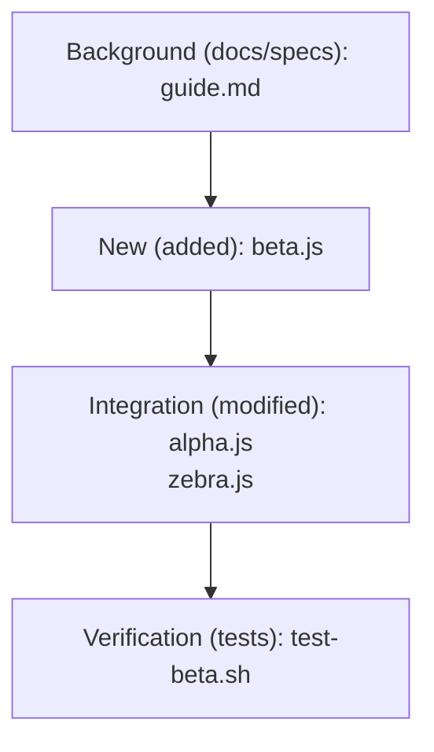

# Explainer for `16dfff6ae158d5edd0d025a93cb9b13f05a1635b`

> Literate-diff explainer (base `16dfff6ae158d5edd0d025a93cb9b13f05a1635b^1`). Grounded in the ACTUAL diff + recorded test
> results, NOT any agent/author narrative. Read top to bottom; the diff below is
> in READING order, not git's alphabetical order. The commit message is shown as UNVERIFIED
> metadata only; where it disagrees with the code, the code below is the source of truth.

## Background

The context a reader needs before the change. Files that carry it (specs, ADRs, docs) come
first in the reading order below. narrate-log supplies the prose arc; the grounded facts:

- Files touched (reading order): docs/guide.md beta.js alpha.js zebra.js tests/test-beta.sh 
- Commit subject (UNVERIFIED author metadata, cross-check against the diff): wire beta helper into alpha and zebra

## Goal and intuition

Concepts before code: what this change is FOR, read OFF THE DIFF (not the commit message).
commands/explain.md enriches this via narrate-log, keeping every claim traceable to a hunk below.

- Goal (derived from the diff): adds beta.js, docs/guide.md, tests/test-beta.sh; modifies alpha.js, zebra.js

## The change, in reading order

Each file in the order a human should read it (background -> new concept -> integration ->
verification), with its actual hunk. This is a PROSE ordering; a raw `git diff` would list
these alphabetically.

### docs/guide.md

```diff
diff --git a/docs/guide.md b/docs/guide.md
new file mode 100644
index 0000000..fb25723
--- /dev/null
+++ b/docs/guide.md
@@ -0,0 +1,2 @@
+# Guide
+Background for the reader.
```

### beta.js

```diff
diff --git a/beta.js b/beta.js
new file mode 100644
index 0000000..f633758
--- /dev/null
+++ b/beta.js
@@ -0,0 +1 @@
+function beta(){ return 2; }
```

### alpha.js

```diff
diff --git a/alpha.js b/alpha.js
index cb104a4..2dbe793 100644
--- a/alpha.js
+++ b/alpha.js
@@ -1 +1,2 @@
 let a = 1;
+let a2 = 2; // wired in
```

### zebra.js

```diff
diff --git a/zebra.js b/zebra.js
index 7f023c5..24b15a7 100644
--- a/zebra.js
+++ b/zebra.js
@@ -1 +1,2 @@
 let z = 1;
+let z2 = 2; // wired in
```

### tests/test-beta.sh

```diff
diff --git a/tests/test-beta.sh b/tests/test-beta.sh
new file mode 100644
index 0000000..37204cf
--- /dev/null
+++ b/tests/test-beta.sh
@@ -0,0 +1 @@
+echo beta test
```

## Diagram

The change map (mermaid, GitHub-native). commands/explain.md may replace this with a richer
conceptual figure via svg-knowledge-diagram.



### Recorded test result

[no recorded test result for 16dfff6ae158d5edd0d025a93cb9b13f05a1635b]
